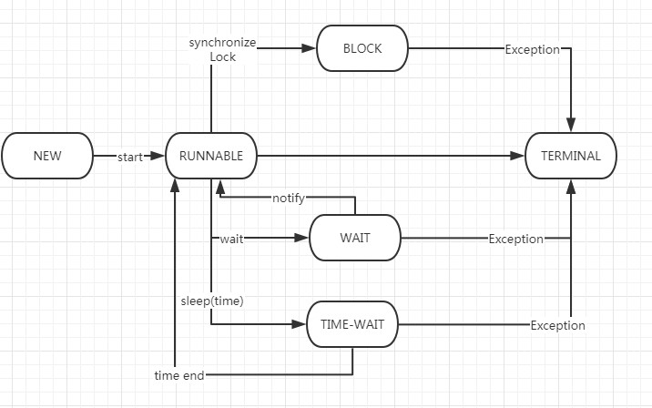
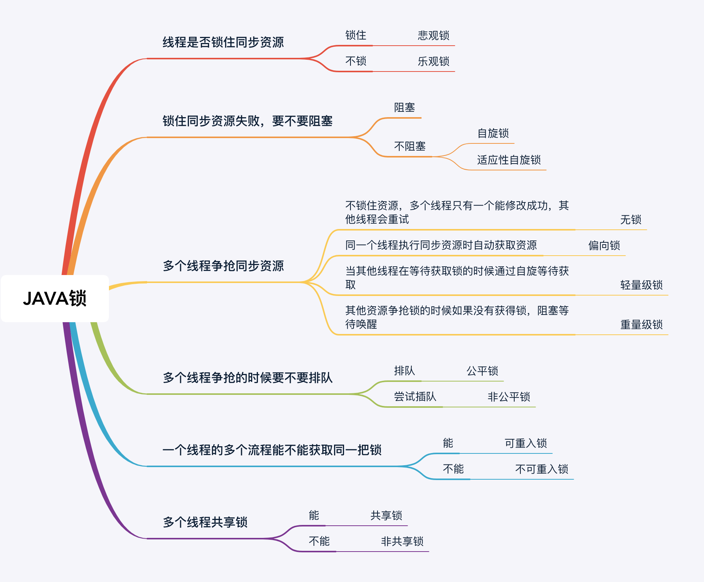
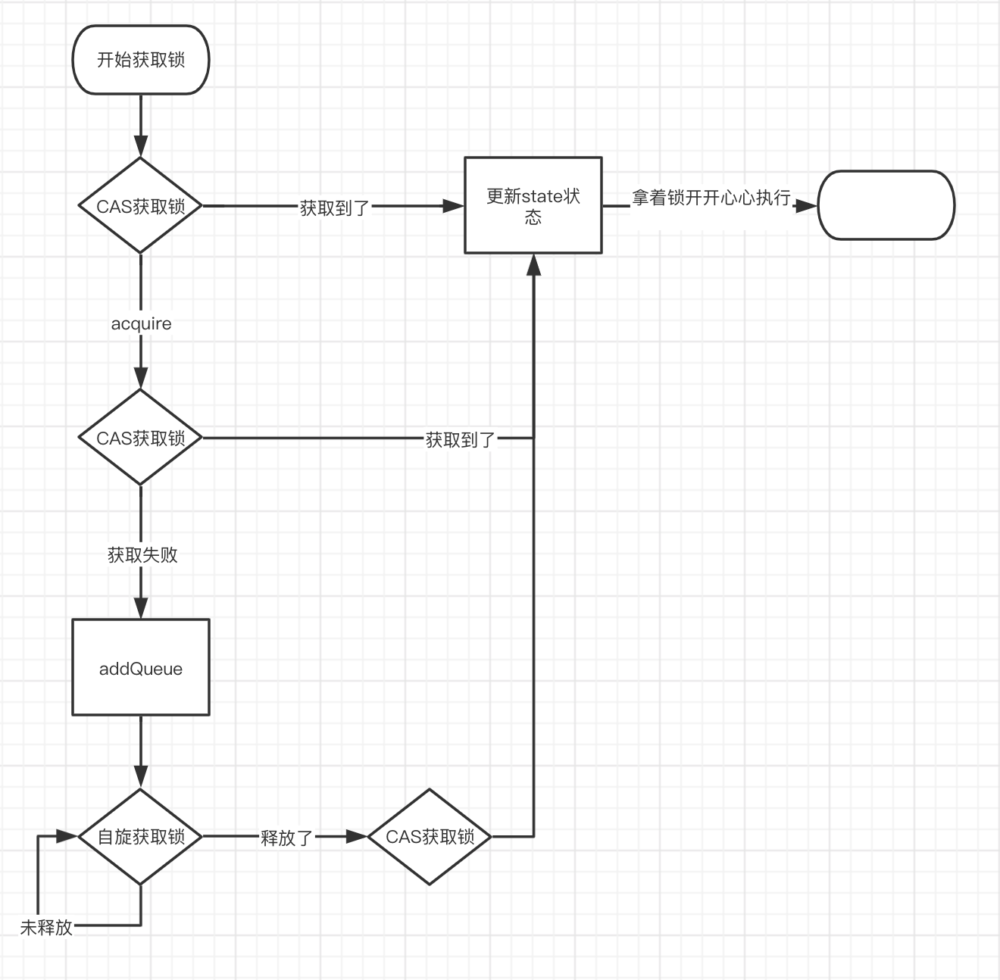

# 	一、JAVA技术栈


Spring Framework

Spring Boot

Spring Cloud

Spring Data 

Spring Cloud Data FLow

Spring Security


Hystrix 服务熔断

Zuul   API网关

Ribbbon  负载均衡

Feign webservice 客户端代理

Zookeeper  分布式协调服务

Consul  分布式协调服务

Eureka  服务发现

Dubbo  分布式服务治理


Etcd

Nginx 

Kong

Apollo

Nacos

ELK

​	Elasticsearch 实时搜索框架

​	Logstash  日志流处理

​	Kibana 数据渲染展示

K8s	kubernetes

Docker


Solr  搜索服务 


webmagic 爬虫框架


# 二、JAVA 基础

## 2.1 运算 

### 2.1.1 位移运算

```
<< : 左移运算符，num <<1,相当于num乘以2
int n = 7;       // 00000000 00000000 00000000 00000111 = 7
int a = n << 1;  // 00000000 00000000 00000000 00001110 = 14
int b = n << 2;  // 00000000 00000000 00000000 00011100 = 28
int c = n << 28; // 01110000 00000000 00000000 00000000 = 1879048192
int d = n << 29; // 11100000 00000000 00000000 00000000 = -536870912

>> : 右移运算符，num >>1,相当于num除以2
int n = 7;       // 00000000 00000000 00000000 00000111 = 7
int a = n >> 1;  // 00000000 00000000 00000000 00000011 = 3
int b = n >> 2;  // 00000000 00000000 00000000 00000001 = 1
int c = n >> 3;  // 00000000 00000000 00000000 00000000 = 0

int n = -536870912;
int a = n >> 1;  // 11110000 00000000 00000000 00000000 = -268435456
int b = n >> 2;  // 11111000 00000000 00000000 00000000 = -134217728
int c = n >> 28; // 11111111 11111111 11111111 11111110 = -2
int d = n >> 29; // 11111111 11111111 11111111 11111111 = -1

>>> : 无符号右移，忽略符号位，空位都以0补齐，（计算机中数字以补码存储，首位为符号位）。
int n = -536870912;
int a = n >>> 1;  // 01110000 00000000 00000000 00000000 = 1879048192
int b = n >>> 2;  // 00111000 00000000 00000000 00000000 = 939524096
int c = n >>> 29; // 00000000 00000000 00000000 00000111 = 7
int d = n >>> 31; // 00000000 00000000 00000000 00000001 = 1

如：a  =  00110111，则a>>2    = 00001101，b=11010011，则b>>2   =  11110100；  

如：a  =  00110111，则a>>>2  = 00001101，b=11010011，则b>>>2 =  00110100。

```


### 2.1.2 位运算

**&**

与运算的规则是，必须两个数同时为`1`，结果才为`1`：

```java
n = 0 & 0; // 0
n = 0 & 1; // 0
n = 1 & 0; // 0
n = 1 & 1; // 1
```

**|**

或运算的规则是，只要任意一个为`1`，结果就为`1`：

```java
n = 0 | 0; // 0
n = 0 | 1; // 1
n = 1 | 0; // 1
n = 1 | 1; // 1
```

**~**

非运算的规则是，按位取反

```java
n = ~0; // 1
n = ~1; // 0
```

^ 

异或运算的规则是，如果两个数不同，结果为`1`，否则为`0`：

```java
n = 0 ^ 0; // 0
n = 0 ^ 1; // 1
n = 1 ^ 0; // 1
n = 1 ^ 1; // 0
```

## 2.2 Collection


### ArrayList
**Features**

- ArrayList 是一个动态的可变的数组，其内部主要是由一个 Object[] 数组来存储数据，实现了List ，RandomAccess，Serializable
- ArrayList 初始化大小是10，最大可以存放INTEGER.MAXVALUE个元素，但是这个时候要考虑方法栈的大小。
- ArrayList 序列化的时候是遍历没一个元素进行序列化。`writeObject`
- ArrayList 新增的时候，每次在数组满了之后才会新增数组，增加的是现有的一半（1.5倍扩容），并且是直接Copy过去
- 删除元素，直接把后面的元素整体复制到前面。
- fail-fast modCounr 用来记录ArrayListde 改变次数，所以，在迭代器迭代的时候如果count，发生改变了，则会抛出exception。这就是为啥不能再for循环的时候删除元素，只能在迭代器里面进行删除

**Question**

最大有多少个元素，是否能存那么多个，要考虑内存够不够，一个栈的内存能放多少。


### Vector

**Features**

- 线程安全版本的ArrayList，内部方法基本上都差不多。
- 每次扩容成倍的扩容

Vector如果单纯是为了线程安全考虑的话，是可以有替代方案的

```java
 Collections.synchronizedCollection(new ArrayList<>());
```

```java
CopyOnWriteArrayList copyOnWriteArrayList = new CopyOnWriteArrayList();
```

CopyOnWriteArrayList 新增的时候每次都会copy原来的数组，在读的时候不会锁，只加了个写锁，在高并发情况下读多写少的情况下可以用这个，但是无法避免脏读现象

### LinkedList 

数据结构

```java
/**
     * Pointer to first node.
     * Invariant: (first == null && last == null) ||
     *            (first.prev == null && first.item != null)
     */
transient Node<E> first;

    /**
     * Pointer to last node.
     * Invariant: (first == null && last == null) ||
     *            (last.next == null && last.item != null)
     */
transient Node<E> last;

private static class Node<E> {
    E item;
    Node<E> next;
    Node<E> prev;

    Node(Node<E> prev, E element, Node<E> next) {
        this.item = element;
        this.next = next;
        this.prev = prev;
    }
}
```


**Features**

- LinkedList是一个双向的链表，存储了头指针和 尾指针。这两个Node就是两个链表。
- 序列化的时候和ArrayList一样，遍历每一个元素
- 不支持随机查找，只能挨个遍历，新增和删除很快，但是查找却很慢。是因为查找的时候只能从前遍历或者从后遍历。


### Queue

实现的是一个FIFO队列，队列头部是存在最长的元素，尾部存放的是刚插入的元素。

实现类如下


阻塞型队列

| 队列种类              | 特性                                                     |
| --------------------- | -------------------------------------------------------- |
| ArrayBlockingQueue    | 是一个阻塞的有限的数组型队列，初始化的时候需要指定大小   |
| PriorityBlockingQueue | 一个无界的阻塞队列使用带有排序规则，并提供阻塞检索操作。 |
| LinkedBlockingQueue   | 基于链表的阻塞型队列,可动态扩展最大Integer.Max           |

非阻塞型队列

​	


### HashSet

**Features**

**应用场景**

线程池的所有线程就放在HashSet里面

### HashMap

**Features**

- 初始化大小是16，新增因子是0.75 
- HashMap的第一层是`Node<K,V>[] table`，key存放的是hash ，Node存放的是数据，可以是个object ，单向链表，树。在他的单个node的size大于 等于8时，为了查询效率转化为红黑树，当转的时候，如果发现Hashtale的size小于64的话，会选择直接扩容HashTable，而不去转红黑树。
- HashMap在扩容的时候，oldTab.length << 1 ,然后再拿所有的hash重新按照size计算一下。放入新的tab中

**应用场景**


**源码分析**

put分析

```java
/**
 * Implements Map.put and related methods
 *
 * @param hash hash for key
 * @param key the key
 * @param value the value to put
 * @param onlyIfAbsent if true, don't change existing value
 * @param evict if false, the table is in creation mode.
 * @return previous value, or null if none
 */
final V putVal(int hash, K key, V value, boolean onlyIfAbsent,
               boolean evict) {
    Node<K,V>[] tab; Node<K,V> p; int n, i;
    //如果table不存在，新增table
    if ((tab = table) == null || (n = tab.length) == 0)
        n = (tab = resize()).length;
    // 用hash与table大小进行计算，看看是否能得到table的数组的下标的链表，没有的话新增node，在这里n是hashMap的大小，就是为了让n与hash参与运算，hash的值也会与自己的高16位参与一个异或运算，为了保证一个散列程度
    if ((p = tab[i = (n - 1) & hash]) == null)
        tab[i] = newNode(hash, key, value, null);
    else {
        //如果拿到了Node
        Node<K,V> e; K k;
        // 如果发现Node的key相等，那么就覆盖
        if (p.hash == hash &&
            ((k = p.key) == key || (key != null && key.equals(k))))
            e = p;
        // 如果不相等，看看这个key是否已经变为树
        else if (p instanceof TreeNode)
            e = ((TreeNode<K,V>)p).putTreeVal(this, tab, hash, key, value);
        // 不是树就是单向的链表，头部开头的链表
        else {
            for (int binCount = 0; ; ++binCount) {
                if ((e = p.next) == null) {
                    p.next = newNode(hash, key, value, null);
                    // 这里判断要不要转为树
                    if (binCount >= TREEIFY_THRESHOLD - 1) // -1 for 1st
                        treeifyBin(tab, hash);
                    break;
                }
                // 赋值给当前节点
                if (e.hash == hash &&
                    ((k = e.key) == key || (key != null && key.equals(k))))
                    break;
                p = e;
            }
        }
        if (e != null) { // existing mapping for key
            V oldValue = e.value;
            if (!onlyIfAbsent || oldValue == null)
                e.value = value;
            //linkedHashMap所拥有的特性
            afterNodeAccess(e);
            return oldValue;
        }
    }
    ++modCount;
    if (++size > threshold)
        resize();
    //linkedHashMap所拥有的特性
    afterNodeInsertion(evict);
    return null;
}
```


resize 重新扩容

```java
/**
 * Initializes or doubles table size.  If null, allocates in
 * accord with initial capacity target held in field threshold.
 * Otherwise, because we are using power-of-two expansion, the
 * elements from each bin must either stay at same index, or move
 * with a power of two offset in the new table.
 *
 * @return the table
 */
final Node<K,V>[] resize() {
    Node<K,V>[] oldTab = table;
    int oldCap = (oldTab == null) ? 0 : oldTab.length;
    int oldThr = threshold;
    int newCap, newThr = 0;
    if (oldCap > 0) {
        if (oldCap >= MAXIMUM_CAPACITY) {
            threshold = Integer.MAX_VALUE;
            return oldTab;
        }
        else if ((newCap = oldCap << 1) < MAXIMUM_CAPACITY &&
                 oldCap >= DEFAULT_INITIAL_CAPACITY)
            newThr = oldThr << 1; // double threshold
    }
    else if (oldThr > 0) // initial capacity was placed in threshold
        newCap = oldThr;
    else {               // zero initial threshold signifies using defaults
        newCap = DEFAULT_INITIAL_CAPACITY;
        newThr = (int)(DEFAULT_LOAD_FACTOR * DEFAULT_INITIAL_CAPACITY);
    }
    if (newThr == 0) {
        float ft = (float)newCap * loadFactor;
        newThr = (newCap < MAXIMUM_CAPACITY && ft < (float)MAXIMUM_CAPACITY ?
                  (int)ft : Integer.MAX_VALUE);
    }
    threshold = newThr;
    @SuppressWarnings({"rawtypes","unchecked"})
        Node<K,V>[] newTab = (Node<K,V>[])new Node[newCap];
    table = newTab;
    if (oldTab != null) {
        for (int j = 0; j < oldCap; ++j) {
            Node<K,V> e;
            if ((e = oldTab[j]) != null) {
                oldTab[j] = null;
                if (e.next == null)
                    newTab[e.hash & (newCap - 1)] = e;
                else if (e instanceof TreeNode)
                    ((TreeNode<K,V>)e).split(this, newTab, j, oldCap);
                else { // preserve order
                    Node<K,V> loHead = null, loTail = null;
                    Node<K,V> hiHead = null, hiTail = null;
                    Node<K,V> next;
                    do {
                        next = e.next;
                        if ((e.hash & oldCap) == 0) {
                            if (loTail == null)
                                loHead = e;
                            else
                                loTail.next = e;
                            loTail = e;
                        }
                        else {
                            if (hiTail == null)
                                hiHead = e;
                            else
                                hiTail.next = e;
                            hiTail = e;
                        }
                    } while ((e = next) != null);
                    if (loTail != null) {
                        loTail.next = null;
                        newTab[j] = loHead;
                    }
                    if (hiTail != null) {
                        hiTail.next = null;
                        newTab[j + oldCap] = hiHead;
                    }
                }
            }
        }
    }
    return newTab;
}
```


### ConcurrentHashMap

数据结构

```java
final int hash;
final K key;
volatile V val;
volatile Node<K,V> next;
```

并发安全的HashMap

**Features**

- 初始化的时候 通过 ```SIZECTL```来控制线程的并发创建问题。

- 新增数据的时候  如果Hash节点的数据为空，通过CASObject保证原子性.如果hash节点不为空，利用synchronized来保证原子性。

- 利用数组```CounterCell[] ```，分而治之的思想 将map的size分散到每个元素中，计算size的时候sum一下，这样保证了并发下的响应速度。

- 可以支持并发扩容。用标志位和自旋操作实现了，标志位标志了当前有多少线程正在扩容。

- 链表转红黑树要满足两个条件，1、单个节点的数量大于8，2、tabs的size大于64

  
  
  

### LinkedHashMap


**Features**

- 插入有序的HashMap 底层考一个LinkedList来维护。
- accessOrder 决定了是插入排序，还是读取排序，fail为插入排序，true为读取排序，每日插入或者读取，都会将当前元素放在链表的尾部

可以依靠LinkedHashMap的特性来实现LRU算法， 

```java
public class LRUCache extends LinkedHashMap {

   /**
    * 保存3个热点
    */
   private static int MAX_ENTRIES;

   /**
    * 初始化最大热点数量
    * @param maxEntries
    */
   public LRUCache(int maxEntries) {
      super();
      MAX_ENTRIES = maxEntries;
   }

   /**
    * 如果返回true，则删除头结点
    * @param eldest
    * @return
    */
   @Override
   protected boolean removeEldestEntry(Map.Entry eldest) {
      return size() > MAX_ENTRIES;
   }
}
```


### WeakHashMap

基本特点就是Key如果没有被其他实际对象引用，则会被垃圾回收掉。

tomcat中的ConcurrentCache 是通过WeakHashMap和ConcurrentHashMap实现的

```java
public final class ConcurrentCache<K,V> {

    private final int size;
	// 伊甸园
    private final Map<K,V> eden;
	// 持久代
    private final Map<K,V> longterm;

    public ConcurrentCache(int size) {
        this.size = size;
        this.eden = new ConcurrentHashMap<>(size);
        this.longterm = new WeakHashMap<>(size);
    }
	// 先从伊甸园里面找
    public V get(K k) {
        V v = this.eden.get(k);
        // 找不到再从持久代里面找，
        if (v == null) {
            synchronized (longterm) {
                v = this.longterm.get(k);
            }
            // 如果找到了，放入伊甸园中
            if (v != null) {
                this.eden.put(k, v);
            }
        }
        return v;
    }

    public void put(K k, V v) {
        // 如果热点区域的大小超过预制的大小，则放入WeakHashMap中，依靠JVM进行GC
        if (this.eden.size() >= size) {
            synchronized (longterm) {
                this.longterm.putAll(this.eden);
            }
            this.eden.clear();
        }
        this.eden.put(k, v);
    }
}
```


## 2.3  序列化

**定义**

把JAVA内存数据转换成可储存的数据（二进制数组）。数据的持久化。

序列化是指把一个Java对象变成二进制内容，本质上就是一个`byte[]`数组。

为什么要把Java对象序列化呢？因为序列化后可以把`byte[]`保存到文件中，或者把`byte[]`通过网络传输到远程，这样，就相当于把Java对象存储到文件或者通过网络传输出去了。

有序列化，就有反序列化，即把一个二进制内容（也就是`byte[]`数组）变回Java对象。有了反序列化，保存到文件中的`byte[]`数组又可以“变回”Java对象，或者从网络上读取`byte[]`并把它“变回”Java对象。


参考资料：https://blog.csdn.net/xpsallwell/article/details/80421882

序列化工具：

| 工具       | 相关类                                | 特性           |
| ---------- | ------------------------------------- | -------------- |
| JDK原生    | ObjectOutputStream，ObjectInputStream | 转换成二进制   |
| fastJson   | JSON，JSONObject                      | 转换成字符串   |
| kryo       | kryo，input，output                   | 格式小，速度快 |
| protostuff |                                       |                |


## 2.3 反射

**定义**

​	反射：根据Class 的路径和名称，来映射出来他的方法，参数等信息。在运行时动态获取class的基本信息，和动态调用方法的行为称之为反射。


## 2.5 内存模型


## 2.6 线程并发

### 线程状态

NEW、RUNNABLE 、BLOCK、WAIT、TIMEWAIT、TERMINATED

状态机如下



- NEW	创建一个县城
- RUNNABLE  可能正在运行，也可能正在等待CPU时间片 （包含了操作系统线程状态中的RUNNING和READY）
- BLOCKED  获得了一个排它锁，等待其他线程释放
- WAITTING  无限期等待，只能依靠notify唤醒， join也会等待，等待其他线程执行完毕，park、unpark
- TIMEWATTING  join，parkNanos 、parkUntil  wait  
- TERMINATED 死亡


### 线程池

**Features**：

​	限流：

​	降低创建和销毁的耗时

​	提高处理速度


| 线程池                  | 特性                                         |
| ----------------------- | -------------------------------------------- |
| newCachedThreadPool     | 缓存线程池，存活60L，可以创建出Max个线程     |
| newFixedThreadPool      | 固定线程池，固定创建X个线程池，存活0         |
| newSingleThreadExecutor | 单一线程池                                   |
| newWorkStealingPool     | 并行线程池，1.7新增，根据CPU核心数量并行计算 |
| newScheduledThreadPool  | 定时任务线程池，多用于monitor，              |

线程池的缓冲队列是最大的，有可能被撑爆造成OOM


#### ThreadPoolExecutor

一般线程池都是基于  ThreadPoolExecutor 类来创建的的。


before after 可以重写


线程池大小，取决于硬件环境和软件环境

硬件是要根据CPU的核心数。 

软件是要根据线程执行的情况，IO密集型(CPU时间片的切换)，和CPU密集型(CPU利用率高)

有一个公式。


### 线程安全

#### volatile、synchronize、Lock

| 种类        | 特征                                                         |
| ----------- | ------------------------------------------------------------ |
| volatile    | 只能保证有序性和可见性和单次指令的原子性，防止指令重排序     |
| synchronize | JVM级别的锁 非公平 1.8之后运用的是自旋锁，                   |
| Lock        | JDK级别的锁  默认非公平，也可以设置成公平锁， 内部靠state来判断状态 |


volatile 是基于内存屏障的，memory barrier。

synchronized  ，有两个作用域，一个是同步方法， 一个是同步代码块  this只在一个对象的作作用域找那个起作用，class在整个容器中的class都起作用

对于同步方法，JVM采用`ACC_SYNCHRONIZED`标记符来实现同步。 

对于同步代码块。JVM采用`monitorenter`、`monitorexit`两个指令来实现同步。


#### 锁的比较

参考网址：https://www.cnblogs.com/jyroy/p/11365935.html




**乐观锁、悲观锁**：

乐观锁：不排斥其他线程。 因为在使用的时候不关心别人是否更新了，只有在更新的时候去比较一下。  通常使用CAS 算法。

悲观锁：排斥其他线程，只能串行，悲观锁认为自己在修改数据的时候一定会有别人线程来争抢资源。类似于Lock，synchronized


无锁、偏向锁、轻量级锁、重量级锁

这四种状态都是针对synchronized的。 1.6之前 synchronized是重量级锁，1.6之后引入了偏向锁和轻量级锁。

这些都基于一个Mark Word


 lock，synchronized


AQS REENTRANTLOCK CAS ATOMIC


- StampedLock  jdk1.8 新出的乐观锁，因为读写锁，在读的时候，写的锁一直拿不到
- ReentrantLock 可重入锁，也可以说是非公平锁。
- ReentrantReadWriteLock 可重入读写锁。在写的时候加锁，读的时候不加锁。

ReadWrite 读写锁 与java8的StampedLock比较

ReetrantLock 可重入锁 可以显示的 加锁和释放锁，建议用finally来保证锁的释放

死锁。 要写出来个死锁


#### ReentrantLock

- ReentrantLock 可重入锁，也可以说是非公平锁。
- ReentrantReadWriteLock 可重入读写锁。在写的时候加锁，读的时候不加锁。

ReadWrite 读写锁 与java8的StampedLock比较

ReetrantLock 可重入锁 可以显示的 加锁和释放锁，建议用finally来保证锁的释放


#### AQS

AbstractQueuedSynchronizer，Lock的底层就是通过AQS来实现的。

是根据双向链表加一个state实现的. 


当锁被占用的时候，加入队列中

```java
public final void acquire(int arg) {
    if (!tryAcquire(arg) &&
        acquireQueued(addWaiter(Node.EXCLUSIVE), arg))
        selfInterrupt();
}
```

tryAcquire  尝试再拿一次锁

addWaiter  将锁加入链表

acquireQueued  自旋等待





#### CAS 无锁同步机制

 Compare And Swap 乐观锁	，依靠操作系统的native方法


### 线程通信

**interrupt**

Interrupt 实际上是一个信号，只是设置了一个中断状态而已，如果线程在sleep wait等状态，会抛出异常，如果在I/O Block状态下 抛出一个ClosedByInterruptException异常

```
interrupt的核心就是设置一个状态，如果不在Runnable中就会抛出一个异常，如果在的话，就会标记为成已经失效的状态
```


**wait，notify ，notifyAll**

wati的时候会释放锁，等待其他线程调用 notify,notifyAll 来唤醒。

wait会释放锁，但是sleep不会。


**yield**

线程让步


Condition来唤醒线程

阻塞队列来控制BlockingQueue

LockSupport 可以手工听，park和unpark


### 线程相关的类

**ThreadLocal** 线程内的一个map

countDownLaunch，等所有countdown之后继续执行，

CyclicBarrier，等待所有线程就绪后一起执行


### MESI 缓存一致性

M：Modify 

E：Exclusive  

S：Share

I：Invalid


​	在多核处理器中，缓存一般分为两大类，一类是所有CPU的共享缓存，另一类是每个CPU独占的缓存。正式因为有这两类，所以引发出了MESI缓存一致性的处理方案。

​	为了保证各个核心CPU的缓存是一致的，实现了缓存一致性协议（MESI），每个处理器通过嗅探在总线上传播的数据来检查自己缓存的值是不是过期了，当处理器发现自己缓存行对应的内存地址被修改，就会将当前处理器的缓存行设置成无效状态，当处理器对这个数据进行修改操作的时候，会重新从系统内存中把数据读到处理器缓存里。


## 2.7 JAVA 虚拟机


## 2.XX Java8新特性

1、接口式编程

2、lamada表达式

3、interface default

4、stream处理

5、parallelStream ，stream 新能比较


# 三、JAVA 框架

**面试时候的思路**

​	如果被问到Spring项管的信息，首先从Spring整体生态来说。

Spring 官网上的project 有 spring Boot、Spring Framework 、Spring Data 、Spring Cloud、Spring Batch、Spring Security

我们经常用的就是SpringFramework、Spring Boot、 Spring Cloud。

Spring Framework：

​	SpringFramework是Spring整个生态体积中的基石，每一个Spring的project都会依赖SpringFramework里面的内容。SpringFramework 主要特点 代码相关的有依赖注入，控制反转，事件驱动，面向切面，数据绑定，数据转换等等。上面的在面试中肯定记不太清，或者我认为单纯这样硬背，我可能背不下来，所以换个思路，从Spring的jar包结构来说明他都干了什么

| package                            | describe                                             |
| ---------------------------------- | ---------------------------------------------------- |
| org.springframework:spring-core    | 基本的一些代码，cglib，annotation，asm，util         |
| org.springframework:spring-aop     | aseptj 面向切面                                      |
| org.springframework:spring-beans   | Bean工厂的管理，包括了解析配置，初始化，自动装配等   |
| org.springframework:spring-context | Application 上下文，时间，等容器，与beans共同实现IOC |
| org.springframework:spring-jdbc    | 数据源管理                                           |
| org.springframework:spring-webmvc  | 对servlet的一个封装。                                |
| org.springframework:spring-orm     | 数据持久化层                                         |
|                                    |                                                      |


## 3.1 SpringFramework

### Features

- [Core technologies](https://docs.spring.io/spring-framework/docs/current/spring-framework-reference/core.html): dependency injection, events, resources, i18n, validation, data binding, type conversion, SpEL, AOP.
- [Testing](https://docs.spring.io/spring-framework/docs/current/spring-framework-reference/testing.html): mock objects, TestContext framework, Spring MVC Test, `WebTestClient`.
- [Data Access](https://docs.spring.io/spring-framework/docs/current/spring-framework-reference/data-access.html): transactions, DAO support, JDBC, ORM, Marshalling XML.
- [Spring MVC](https://docs.spring.io/spring/docs/current/spring-framework-reference/web.html) and [Spring WebFlux](https://docs.spring.io/spring/docs/current/spring-framework-reference/web-reactive.html) web frameworks.
- [Integration](https://docs.spring.io/spring-framework/docs/current/spring-framework-reference/integration.html): remoting, JMS, JCA, JMX, email, tasks, scheduling, cache.
- [Languages](https://docs.spring.io/spring-framework/docs/current/spring-framework-reference/languages.html): Kotlin, Groovy, dynamic languages.


### **IOC container**

通过ApplicationContext 是一个顶级接口。是所有beanFactory的顶级接口。他新增了几个特性，更容易的与APO集成、resource的处理（针对于国际化的一些配置），事件发布、特定于很多上下文，比如说webApplicationContext、ReactiveApplicationContext

IOC他是整个Spring中的机主性的存在，主要的特点就是将JavaBean 初始化，装配。每个对象在在容器中通过反射来调用。

**Container Overview**

bean实例的元数据装配主要是通过Xml，Code，Java Annotation。

>- [Annotation-based configuration](https://docs.spring.io/spring-framework/docs/current/spring-framework-reference/core.html#beans-annotation-config): Spring 2.5 introduced support for annotation-based configuration metadata.
>- [Java-based configuration](https://docs.spring.io/spring-framework/docs/current/spring-framework-reference/core.html#beans-java): Starting with Spring 3.0, many features provided by the Spring JavaConfig project became part of the core Spring Framework. Thus, you can define beans external to your application classes by using Java rather than XML files. To use these new features, see the [`@Configuration`](https://docs.spring.io/spring-framework/docs/current/javadoc-api/org/springframework/context/annotation/Configuration.html), [`@Bean`](https://docs.spring.io/spring-framework/docs/current/javadoc-api/org/springframework/context/annotation/Bean.html), [`@Import`](https://docs.spring.io/spring-framework/docs/current/javadoc-api/org/springframework/context/annotation/Import.html), and [`@DependsOn`](https://docs.spring.io/spring-framework/docs/current/javadoc-api/org/springframework/context/annotation/DependsOn.html) annotations.


#### **Bean Overview**

the Bean definition

| Properties               | **Explained**                                                |
| ------------------------ | ------------------------------------------------------------ |
| class                    | 告诉Spring 要加载哪个class                                   |
| name                     | Spring实例化出来的name， 与ID一样                            |
| Scope                    | spring管理的bean的可见性，singleton,prototype,request,session,application,websocket |
| Constructor arguments    | 1、constructor-base注入。2、setter-base注入（解决循环依赖）  |
| Properties               | 通过Xml配置 交给Spring管理的bean                             |
| Autowiring mode          | 自动装配的规则，默认为NO。通常使用NO                         |
| Lazy initialization mode | 延迟加载                                                     |
| Initialization method    | springbean 配置的init-method                                 |
| Destruction method       | springbean 配置的destroyMethod                               |

#### Dependency

依赖注入：

1. constructor-base注入
2. setter-base注入

面试经常问到的循环依赖：

```
							Circular dependencies
If you use predominantly constructor injection, it is possible to create an unresolvable circular dependency scenario.

For example: Class A requires an instance of class B through constructor injection, and class B requires an instance of class A through constructor injection. If you configure beans for classes A and B to be injected into each other, the Spring IoC container detects this circular reference at runtime, and throws a BeanCurrentlyInCreationException.

One possible solution is to edit the source code of some classes to be configured by setters rather than constructors. Alternatively, avoid constructor injection and use setter injection only. In other words, although it is not recommended, you can configure circular dependencies with setter injection.

Unlike the typical case (with no circular dependencies), a circular dependency between bean A and bean B forces one of the beans to be injected into the other prior to being fully initialized itself (a classic chicken-and-egg scenario).
```

@Autowrite 注入类。

@Lookup 实现方法注入


#### Bean Scope


| Scope       | **Description** |
| ----------- | --------------- |
| singleton   | 单例            |
| prototype   | 多例            |
| request     | 请求有效        |
| session     | session有效     |
| application | 应用有效        |
| websocket   |                 |


singleton beans with  prototype bean 如果单例中注入的是多例，那么每一个bean里面的多例都是不同的实例。

如果多例注入单例，那么所有多例中的实例都是一个实例


### 代理

Spring 中 主要有两种形式cglib和jdk


## QUESTION

*Spring支持哪几种bean的作用域？*

*Spring AOP支持哪几种类型的通知？*

application对象的作用？*


# 四、微服务

## 4.1 面向服务的架构 SOA 


## 4.2 Cloud Native

百度百科这样解释

>Cloud Native翻译为云原生，是Matt Stine提出的一个概念，它是一个思想的集合，包括[DevOps](https://baike.baidu.com/item/DevOps/2613029)、[持续交付](https://baike.baidu.com/item/持续交付/9803571)（Continuous Delivery）、[微服务](https://baike.baidu.com/item/微服务/18758759)（MicroServices）、敏捷基础设施（Agile Infrastructure）、康威定律（Conways Law）等，以及根据商业能力对公司进行重组。Cloud Native既包含技术（微服务，敏捷基础设施），也包含管理（DevOps，持续交付，康威定律，重组等）。Cloud Native也可以说是一系列Cloud技术、企业管理方法的集合。


云计算的三层基础架构

```
1、基础设施即服务IaaS)
基础设施即服务是主要的服务类别之一，它向云计算提供商的个人或组织提供虚拟化计算资源，如虚拟机、存储、网络和操作系统。 
2、平台即服务(PaaS)
平台即服务是一种服务类别，为开发人员提供通过全球互联网构建应用程序和服务的平台。Paas为开发、测试和管理软件应用程序提供按需开发环境。 
3、软件即服务(SaaS)
软件即服务也是其服务的一类，通过互联网提供按需软件付费应用程序，云计算提供商托管和管理软件应用程序，并允许其用户连接到应用程序并通过全球互联网访问应用程序。
```


​	在spring体系中，spring提供了一套 cloud navit 的解决方案，其中主要了解一下 MicroService 和DevOps。

Cloud Native的基础设施有

- ​	服务发现     eureka、zookeeper、consul、nacos
- 服务网关    zuul、nginx、openrestry、Spring cloud gateway
- 负载均衡  Ribbon、dubbo、Kong
- 服务容错  hystrix dubbo Kong
- 分布式配置 git， nacos 、zookeeper、consul
- 服务监控  ELK、spring 
- 服务跟踪  zipkin 、openTracing、


## 4.3 Euraka 


服务发现：

- 常见的协议

  - ​	java ： jini

  - ​	Rest： hateoas

  - ​	webservice UDDI  通常使用 WSDL

    

服务注册：

- 常见注册中西

  - zookeeper   比较稳定的注册中心  （从paxos 到zookeeper）

  - Netflix eureka 

  - consul

    

有中心化注册，和去中心化注册（区块链）（Steam），


高可用架构：

​	主要是指标。消灭单点故障。通常通过集群来解决。


注册中心


| 注册中心  | CAP   | 推荐规模  |
| --------- | ----- | --------- |
| Eureka    | AP    | <30K      |
| Zookeeper | CP    | <30k      |
| console   | AP/CP | <5k       |
| nacos     | AP/CP | 199k-200k |


## 4.4 Feign Hystrix

JAVA  RMI  二进制协议

WebService

- ​	xml约束
- ​	json约束

restEasy  实现了JAX-RS2.0


Feign、 Spring Cloud Open Feign ，JAX-RS、Spring Web Mvc 

| 技术                    | e                  | 请求映射路径    | 请求参数 |
| ----------------------- | ------------------ | --------------- | -------- |
| Feign                   | 客户端声明         |                 |          |
| Spring Cloud Open Feign | 客户端声明         | @RequestMapping |          |
| JAX-RS                  | 客户端、服务端声明 | @Patch          |          |
| Spring Web Mvc          | 服务端声明         |                 |          |

Feign 客户端负载均衡  

- 扩展支持（高度扩展，contract 提供Feign接口方法与Rest请求元信息的契约）

  - 内建Feign注解

  - JAX-RX 1/2注解

  - JAXB 

  - OkHttp

    

实现细节猜想

- Java接口与Rest 如何映射

- @FeignClient 注解指定的服务名称用到了服务发现

- @EnableFeigh 自动装配Feign组件

- Feign请求内容是如何序列化的

  

Spring Cloud + Netflix Feign 有一定的延迟。默认30秒

```
ServerListUpdater
```


## 4.5 DUBBO

自我经验应用场景

- 通过SPI协议扩展
- 隐式传参，在Consumer的FIlter中设置，在Provider的Filter中获取

```java
RpcContext.getContext().getAttachment();
```

- 集群容错：有的可以retries，有的则需要boardcast
- 负载均衡：根据业务场景，如果涉及到缓存，应该用最少活跃，或者其他的
- 多版本：根据不同的版本，调用不同的接口处理。
- 服务分组：批量调用和普通调用是不一样的
- 异步调用：
- 控制连接数：
- 路由规则：


Dubbo配置分为三大类：

1. 服务发现：服务的注册与发现，目的是发布服务，并且使调用方可以能够尽快的感知服务的存在
2. 服务治理：负载均衡，集群容错，相关的配置。
3. 性能调优：之所以所谓调优，意思就是不同的配置会有不同的应用场景，根据业务场景来达到最优解。

attention：只有group，interface，version 是服务的匹配条件三者决定是不是同一个服务，其它配置项均为调优和治理参数。


# 五、分布式

## 5.1 分布式的CAP

**概念**

CAP是加州大学伯克利分销的Eric Brewer教授提出来的。指的是在分布式系统中，三个要素最多能实现两点，不可能三者兼顾

- (Consistency) 一致性 ：在分布式系统中所有的数据备份在同一时刻是一致的。同步数据的延迟性极小

- (Available) 可用性 ：	在分布式系统中某一单点节点宕机之后,每个响应依然可以完成

- (Partition tolerance) 分区容错性：	在集群中如果出现错误能够正常服务


一般来说，都是在可用性和一致性上来抉择。


### BASE 理论

Basically Avaliable (基本可用)

Soft state  （软状态）

Eventually consistent (最终一致性)

base理论是对CAP的一种妥协，无法做到强一致，就使用另一种方法来达到最终的目的


### XA协议

1、2PC   to prepare commit  两阶段提交，就是XA协议的原理。牺牲一部分可用性来保证一致性。

第一阶段提交就是预提交，等处理完成后接受返回，判断返回结果来决定下一个请求是commit还是abort。

2、TCC   try catch cancel   执行的时候判断是否出现异常，如果失败，则调用cancel处理。

3、异步补偿机制  ，写入数据的时候如果异常，需要写入一个消息，异步通过消息来对此次写入数据做补偿。


[参考文章](https://www.cnblogs.com/savorboard/p/distributed-system-transaction-consistency.html)


# 六、DB

## 6.1 MySQL

### 主从同步

1. Master接受写请求
2. Master通知slaver同步数据
3. Master等待所有slaver返回结果

这样如果一旦任何一个slaver出错，就可能造成阻塞。


### canal插件


## 6.2 Redis

**Features**

- 单线程的I/O多路复用 线程安全 QPS 极高
- 集群部署
- 数据持久化


### **数据类型**

| 类型    | 简介               | 特性 | 场景 |
| ------- | ------------------ | ---- | ---- |
| String  | 二进制安全的字符串 |      |      |
| List    | 双向链表           |      |      |
| Hash    | hash表             |      |      |
| Set     | 不重复链表         |      |      |
| SortSet | 有序链表           |      |      |


**异常场景**

缓存雪崩：大量缓存的TTS在同一时间失效

缓存击穿：缓存命中问题 

缓存穿透：缓存没命中，数据库也没命中，

淘汰策略

解决方案，布隆过滤器，提前判断缓存中是否有可能存在

主从，哨兵

### 基本操作命令


# 七、网络

## 7.1 HTTP2.0
    Hypertext 超文本协议
    HPACK 


## 7.2 Rest协议
一方面是 requestMethod的运用，另一方面是response 更多的根据状态码来判断。


# 算法


## 布隆过滤器

## 红黑树

## LRU算法

